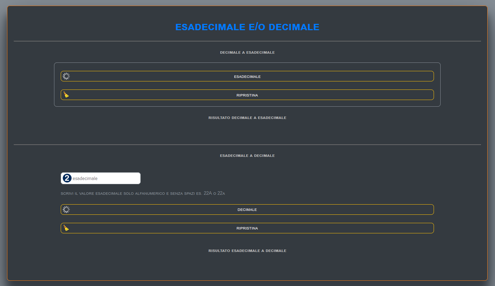
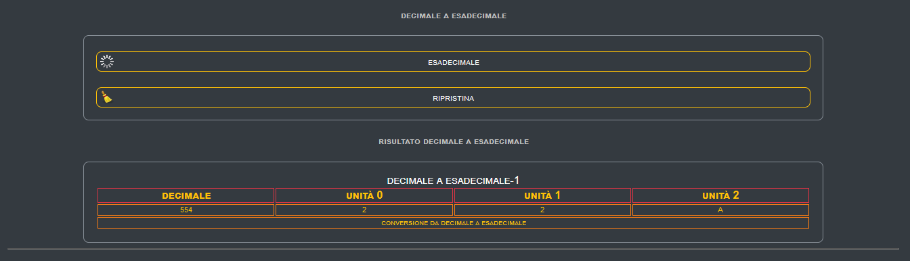
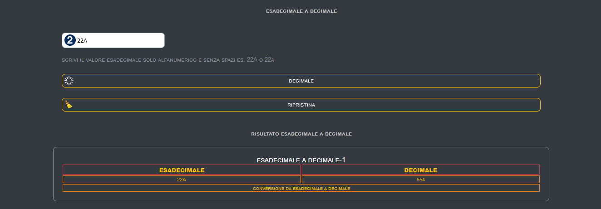

# App dec-esa
 - conversione decimale in esadecimale e esadecimale a decimale

## INIZIO

<h1>Quest'App da la possibilità di convertire decimale in esadecimale e esadecimale a decimale</h1>

GOOD LUCK

## FINE
